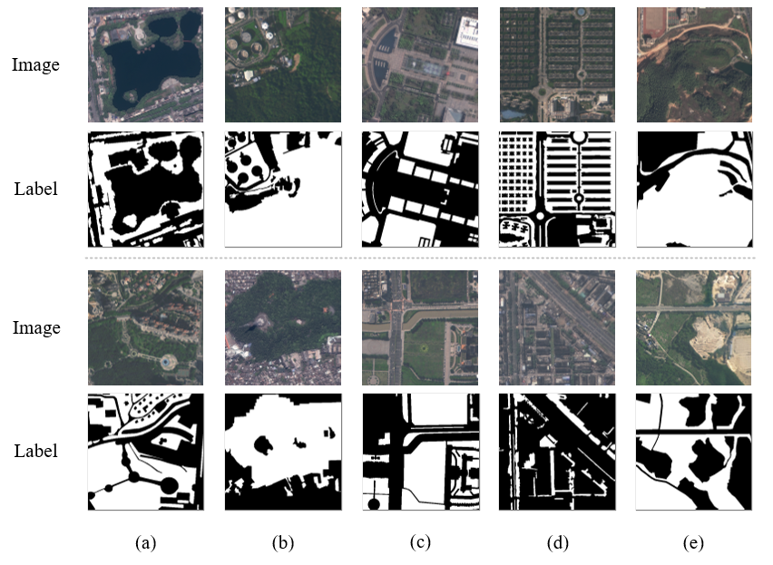

# UGS-1m
[[project link]](https://liumency.github.io/UGS-1m/)

The project provides 1-meter UGS maps of 31 major cities in China (**UGS-1m**), which were generated by a deep learning (DL) framework. A **UGSet** and a **UGSNet** are included in the DL framework for large-scale and high-resolution UGS mapping.

<div align=center><br/></div>

 - **UGS-1m**: a fine-grained UGS map **product** of 31 major cities in China of 1 meter
 - **UGSet**: a large benchmark **dataset** to support and foster the UGS research
 - **UGSNet**: a fully convolutional **network** for fine-grained UGS mapping


## Reference
This work has been published in ESSD [**ESSD**](https://www.earth-system-science-data.net/) [[**Paper Link**](https://essd.copernicus.org/articles/15/555/2023/)].

```markdown
@Article{essd-15-555-2023,
AUTHOR = {Shi, Q. and Liu, M. and Marinoni, A. and Liu, X.},
TITLE = {UGS-1m: fine-grained urban green space mapping of 31 major cities in China based on the deep learning framework},
JOURNAL = {Earth System Science Data},
VOLUME = {15},
YEAR = {2023},
NUMBER = {2},
PAGES = {555--577},
URL = {https://essd.copernicus.org/articles/15/555/2023/},
DOI = {10.5194/essd-15-555-2023}
}
```

## UGS-1m product 

The UGS-1m product provides the fine-grained UGS maps of 31 major cities in China, which is generated based on a deep learning (DL) framework. 


The product is now available at [**ScienceDB**](https://doi.org/10.57760/sciencedb.07049).
The Google Earth imagery used will be available at [**OneDrive**](https://mail2sysueducn-my.sharepoint.com/:f:/g/personal/liumx23_mail2_sysu_edu_cn/EuILVq8vbopKu_juqg4ams8BythT7i1Oe7X-9kQaVn-LAw?e=9aBqSq)

```markdown
@misc{qian2023scidb,
  author       = {Qian Shi and Mengxi Liu and Andrea Marinoni and Xiaoping Liu},
  title        = {UGS-1m: Fine-grained urban green space mapping of 31 major cities in China based on the deep learning framework},
  year         = 2023,
  month        = jan,
  publisher    = {Science Data Bank},
  version      = {V1},
  doi          = {10.57760/sciencedb.07049},
  url          = https://doi.org/10.57760/sciencedb.07049
}
```


## UGSet
A largescale high-resolution urban green space dataset (UGSet). The dataset is now available at [**ScienceDB**](https://doi.org/10.57760/sciencedb.07049) and [**Onedrive**](https://mail2sysueducn-my.sharepoint.com/:f:/g/personal/liumx23_mail2_sysu_edu_cn/EuFVXihDii5OnZB22wJATGkB0zcqNDloT3KkxUwiW3rM8g?e=vq3bpy).



## UGSNet  (Soon available)


### Contact
*Correspondence*: liumx23@mail2.sysu.edu.cn

