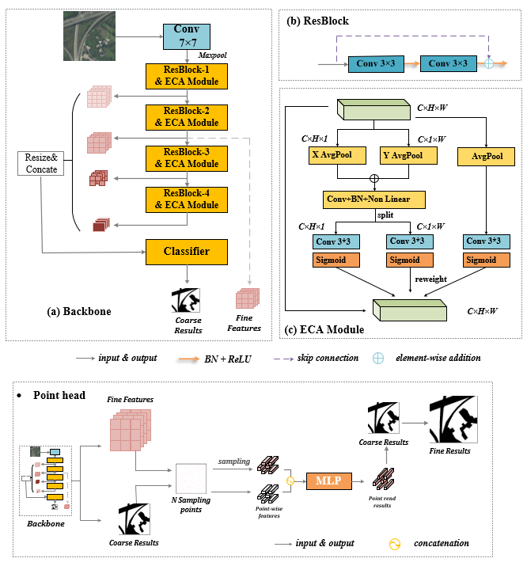

# UGS-1m
The project provides 1-meter UGS maps of 34 major cities/areas in China (**UGS-1m**), which were generated by a deep learning (DL) framework. A **UGSet** and a **UGSNet** are included in the DL framework for large-scale and high-resolution UGS mapping.

 - **UGS-1m**: a fine-grained UGS map **product** of 34 major cities/areas in China of 1 meter
 - **UGSet**: a large benchmark **dataset** to support and foster the UGS research
 - **UGSNet**: a fully convolutional **network** for fine-grained UGS mapping


<br>

## UGS-1m product 

The UGS-1m product provides the fine-grained UGS maps of 34 major cities/areas in China, which is generated based on a deep learning (DL) framework. 

The product is now available at [**Zenodo**](https://doi.org/10.5281/zenodo.6155516).

```markdown
@dataset{qian_shi_2022_6155516,
  author       = {Qian Shi and Mengxi Liu and Andrea Marinoni},
  title        = {UGS-1m: Fine-grained urban green space mapping of 34 major cities in China based on the deep learning framework},
  month        = feb,
  year         = 2022,
  publisher    = {Zenodo},
  doi          = {10.5281/zenodo.6155516},
  url          = {https://doi.org/10.5281/zenodo.6155516}
}
```


<br>

## UGSet (Soon available)
A largescale high-resolution urban green space dataset (UGSet).


<br>

## UGSNet  (Soon available)



<br>

### Contact
*Correspondence*: Mengxi Liu (liumx23@mail2.sysu.edu.cn)
