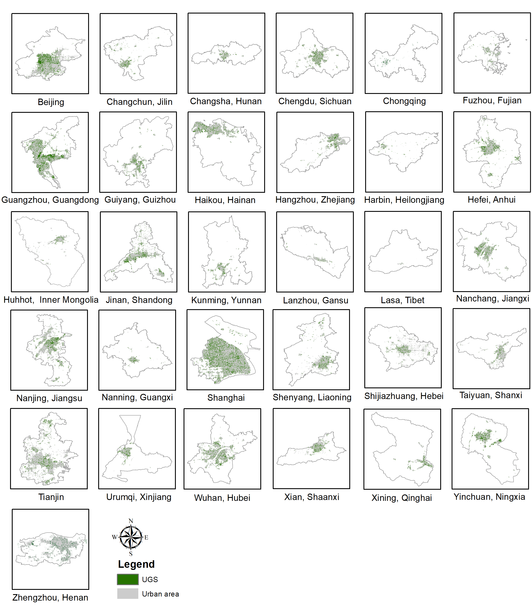

# UGS-1m
The project provides 1-meter UGS maps of 34 major cities/areas in China (**UGS-1m**), which were generated by a deep learning (DL) framework. A **UGSet** and a **UGSNet** are included in the DL framework for large-scale and high-resolution UGS mapping.

 - **UGS-1m**: a fine-grained UGS map **product** of 34 major cities/areas in China of 1 meter
 - **UGSet**: a large benchmark **dataset** to support and foster the UGS research
 - **UGSNet**: a fully convolutional **network** for fine-grained UGS mapping


## Current status
The [**preprint**](https://essd.copernicus.org/preprints/essd-2022-75/) is currently under review for the journal [**ESSD**](https://www.earth-system-science-data.net/).

```markdown
@Article{essd-2022-75,
AUTHOR = {Shi, Q. and Liu, M. and Marinoni, A. and Liu, X.},
TITLE = {UGS-1m: Fine-grained urban green space mapping of 34 major cities in China based on the deep learning framework},
JOURNAL = {Earth System Science Data Discussions},
VOLUME = {2022},
YEAR = {2022},
PAGES = {1--23},
URL = {https://essd.copernicus.org/preprints/essd-2022-75/},
DOI = {10.5194/essd-2022-75}
}
```


## UGS-1m product 

The UGS-1m product provides the fine-grained UGS maps of 34 major cities/areas in China, which is generated based on a deep learning (DL) framework. 

The product is now available at [**Zenodo**](https://doi.org/10.5281/zenodo.6155516).
The Google Earth imagery used will be available at [**OneDrive**](https://mail2sysueducn-my.sharepoint.com/:f:/g/personal/liumx23_mail2_sysu_edu_cn/EuILVq8vbopKu_juqg4ams8BythT7i1Oe7X-9kQaVn-LAw?e=9aBqSq)

```markdown
@dataset{qian_shi_2022_6155516,
  author       = {Qian Shi and Mengxi Liu and Andrea Marinoni},
  title        = {UGS-1m: Fine-grained urban green space mapping of 34 major cities in China based on the deep learning framework},
  month        = feb,
  year         = 2022,
  publisher    = {Zenodo},
  doi          = {10.5281/zenodo.6155516},
  url          = {https://doi.org/10.5281/zenodo.6155516}
}
```


## UGSet
A largescale high-resolution urban green space dataset (UGSet). The dataset is now available at [**Onedrive**](https://mail2sysueducn-my.sharepoint.com/:f:/g/personal/liumx23_mail2_sysu_edu_cn/EuFVXihDii5OnZB22wJATGkB0zcqNDloT3KkxUwiW3rM8g?e=vq3bpy).


## UGSNet  (Soon available)


### Contact
*Correspondence*: liumx23@mail2.sysu.edu.cn
